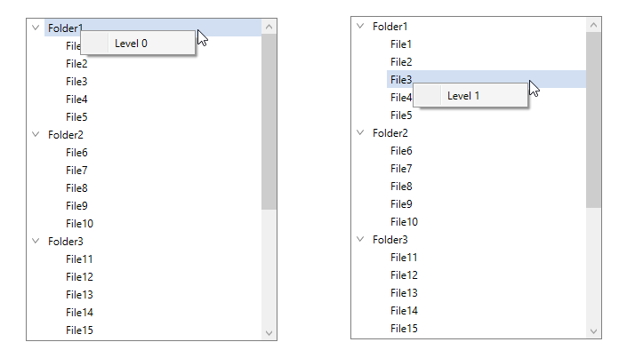

# How to open different ContextMenu for different levels of Nodes in WPF TreeView (SfTreeView)?

## About the sample

This sample illustrates how to open different ContextMenu for different levels of Nodes in WPF TreeView.

[WPF TreeView](https://www.syncfusion.com/wpf-controls/treeview) (SfTreeView), doesn’t have any direct support to open different context menu based on the level of the nodes in which the context menu is opening. However, you can achieve it by handling [SfTreeView.ItemContextMenuOpening](https://help.syncfusion.com/cr/wpf/Syncfusion.UI.Xaml.TreeView.SfTreeView.html#Syncfusion_UI_Xaml_TreeView_SfTreeView_ItemContextMenuOpening) event.

```C#

this.treeView.ItemContextMenuOpening += OnTreeView_ItemContextMenuOpening;

private void OnTreeView_ItemContextMenuOpening(object sender, ItemContextMenuOpeningEventArgs e)
{
    if (e.MenuInfo.Node.Level == 1)
    {
        MenuItem item1 = new MenuItem();
        item1.Header = "Level 1";
        e.ContextMenu.Items.Clear();
        e.ContextMenu.Items.Add(item1);
    }

    else if (e.MenuInfo.Node.Level == 0)
    {
        MenuItem item1 = new MenuItem();
        item1.Header = "Level 0";
        e.ContextMenu.Items.Clear();
        e.ContextMenu.Items.Add(item1);
    }
}


```



## Requirements to run the demo

Visual Studio 2015 and above versions
